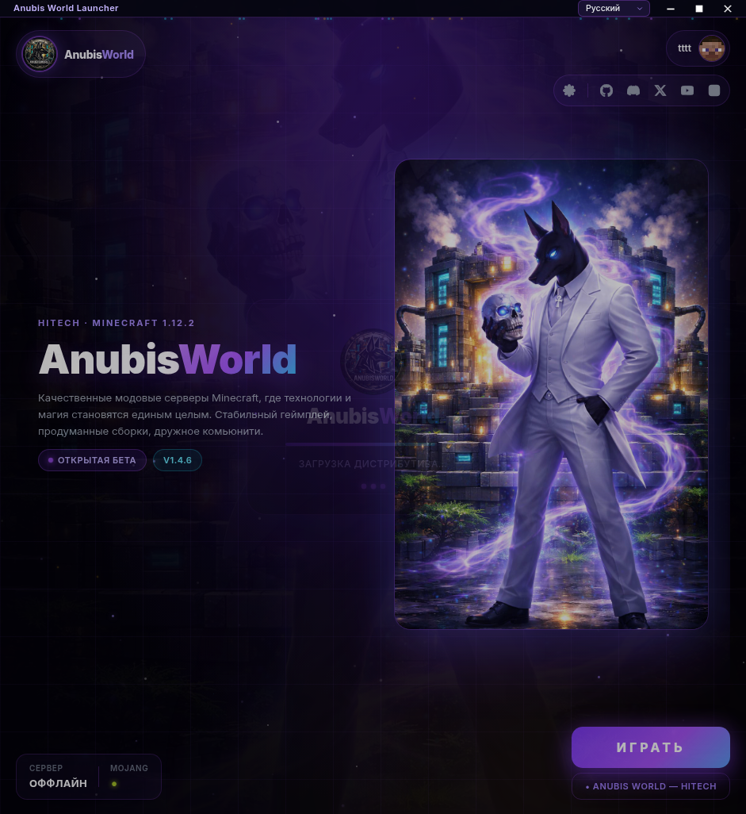

<h1 align="center">Anubis World Launcher</h1>

<p align="center">
  Modded Minecraft launcher for the private <strong>Anubis World — HiTech 1.12.2</strong> server.<br>
  One click — Java, Forge, mods, configs, and updates handled for you.
</p>

<p align="center">
  <a href="https://github.com/damanoreshkan-beep/anubis-launcher/releases/latest"></a>
  <a href="https://github.com/damanoreshkan-beep/anubis-launcher/actions/workflows/release.yml"></a>
  <a href="https://github.com/damanoreshkan-beep/anubis-launcher/releases"></a>
</p>

<p align="center">
  
</p>

## What it does

* **One-click play.** Picks the right Java 8, drops a clean Forge profile, syncs mods and configs against the live server, then launches.
* **Auto-updates.** Both the launcher itself (via electron-updater) and the modpack (via the distribution feed). The modpack auto-syncs from the running server every day — drop a jar on the server, every client picks it up.
* **Real authentication.** Email + password, passwordless 8-digit OTP login, "set new password" recovery via email link, Discord OAuth. One nickname per account, locked at sign-up to keep server inventories tied to the right player.
* **Multi-account.** Add several offline profiles, switch between them in the settings panel.
* **Five languages.** Russian (default), Ukrainian, English, German, Polish.
* **Anubis World branding.** Cinematic hero with the welcome video, glass UI, palette synced with the website.

## Install

Pick the format that matches your OS. Each release ships every target.

| OS | Format | Install |
|---|---|---|
| **Windows** | `.exe` (NSIS) | Run the installer. Auto-updates from inside the launcher. |
| **Arch / Manjaro / EndeavourOS** | `.pkg.tar.zst` | `sudo pacman -U AnubisWorldLauncher-setup-*.pacman` |
| **Ubuntu / Mint / Fedora** | `.AppImage` | `chmod +x *.AppImage` and double-click. |
| **Any other Linux** | `.tar.gz` | `tar -xzf *.tar.gz && ./AnubisWorldLauncher-setup-*/anubis-launcher` |
| **macOS** | `.dmg` | Drag into Applications. |

Get the latest from <https://github.com/damanoreshkan-beep/anubis-launcher/releases/latest>.

## First launch

1. Open the launcher.
2. Sign in (email or Discord) — first time, you pick the Minecraft nickname that follows you on the server.
3. Press **PLAY**. The launcher fetches Java if it's missing, installs Forge 14.23.5.2860, downloads the HiTech mod set (~120 MB), and starts the game.
4. The Anubis World server is preloaded in the multiplayer list — open Multiplayer in Minecraft and join.

That's it. From then on, every launch is `open → PLAY`.

## Project layout

```
anubis-launcher/
├── app/                   # Electron renderer (EJS + jQuery + vanilla JS)
│   ├── landing.ejs           main play screen
│   ├── loginOptions.ejs      auth screen — embeds <anubis-auth> Web Component
│   ├── settings.ejs          account, Java, RAM panel
│   ├── assets/
│   │   ├── css/                Tailwind source + compiled site.css
│   │   ├── images/site/        hero video + palette images
│   │   ├── js/
│   │   │   ├── scripts/          renderer scripts (uicore, landing, settings, …)
│   │   │   └── vendor/           bundled <anubis-auth> Web Component
│   │   └── lang/                 5 .toml locales
│   └── …
├── index.js               # main process — window, deep-link handler, Discord IPC
├── electron-builder.yml   # multi-target build config
├── scripts/
│   └── test-driver.js     # Playwright headed test runner (RESIZE=W,H supported)
└── .github/workflows/
    └── release.yml        # tag push → multi-platform build → GitHub Release
```

## Architecture

```
   Anubis World server (Mohist 1.12.2)            Supabase
   /mods/*.jar  ◄── SFTP                          email + Discord OAuth
        │                                                │
        ▼ daily sync (anubis-distribution repo)          ▼
   docs/distribution.json + Release assets         <anubis-auth> Web Component
        │                                                │
        ▼ HTTP                                           ▼ embedded as Web Component
                ┌──────────────────────────────────────┐
                │       Anubis World Launcher          │
                │  Electron · Helios mod-pipeline fork │
                └──────────────────────────────────────┘
```

Three external systems plug in over HTTP:

* **`damanoreshkan-beep/anubis-distribution`** — Helios-style feed at `https://damanoreshkan-beep.github.io/anubis-distribution/distribution.json`. Auto-rebuilt every day from the live server via SFTP, so the modpack the launcher installs always matches the modpack the server runs.
* **`damanoreshkan-beep/anubis-auth-widget`** — `<anubis-auth>` Web Component shared between this launcher and the website. Updates ship by republishing the bundle; the launcher copy lives at `app/assets/js/vendor/anubis-auth.js`.
* **Supabase** — backs the auth widget. Email OTP is configured for 8-digit codes; recovery uses a magic link with the launcher's `anubisworld://` deep-link scheme to bring the user back into the app.

## Build from source

Requires Node 22.

```bash
git clone https://github.com/damanoreshkan-beep/anubis-launcher.git
cd anubis-launcher
npm ci
npm run build:css       # compile Tailwind once
npm start               # dev mode (Electron + DevTools)
```

Producing release artefacts:

```bash
npm run dist:linux      # AppImage + pacman + tar.gz
npm run dist:win        # NSIS .exe
npm run dist:mac        # .dmg
```

The pacman target needs `bsdtar` on the build host (`libarchive-tools` on Ubuntu, preinstalled on Arch).

Pulling in widget changes from `anubis-auth-widget`:

```bash
cd ../anubis-auth-widget
npm run build
cp dist/anubis-auth.js ../anubis-launcher/app/assets/js/vendor/anubis-auth.js
```

Headed end-to-end test:

```bash
node scripts/test-driver.js inspect           # boot snapshot
node scripts/test-driver.js flow              # auth start → email → forgot → back
node scripts/test-driver.js forgot            # forgot-choice → otp / reset paths
RESIZE=1280,720 node scripts/test-driver.js inspect    # custom viewport
```

Screenshots land in `/tmp/launcher-shots/`. Renderer console + page errors are streamed to stdout.

## Releasing

1. Bump `version` in `package.json`.
2. Commit, tag `vX.Y.Z`, push the tag.
3. CI builds Windows, macOS and the three Linux targets in parallel, then publishes a GitHub Release with all of them.
4. Existing installs see the update notification on next launch.

## Game server

* Address: `94.100.18.18:50273`
* Minecraft 1.12.2 + Forge 14.23.5.2860 (Mohist runtime, plugin-aware)
* Online-mode disabled — auth is enforced at the launcher / server-side plugin layer instead, identity comes from a deterministic offline UUID derived from the picked nickname.

## Credits

Originally a fork of [HeliosLauncher](https://github.com/dscalzi/HeliosLauncher) (MIT). The mod-pipeline core (asset validation, Java fetch, Forge profile builder) is unchanged from upstream; UI, branding, auth, distribution sync, and packaging are Anubis World's own.
